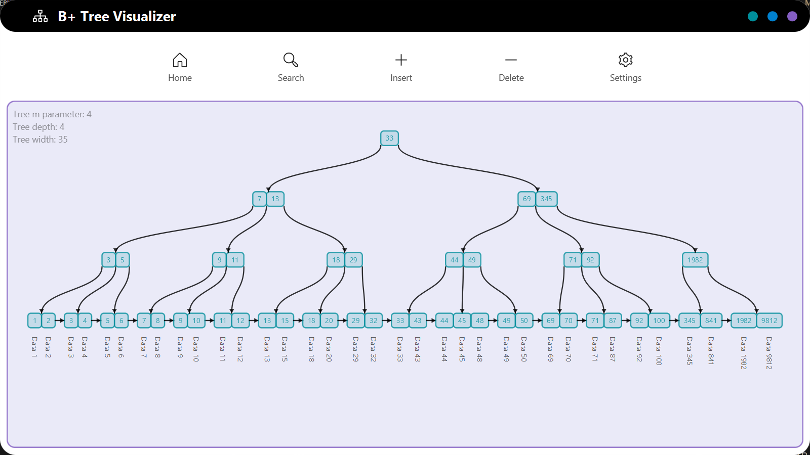

# B+ Tree Visualization Tool 🌳



A JavaFX application for visualizing and interacting with B+ Tree data structures in real-time. This tool provides an intuitive graphical interface to understand B+ Tree operations through smooth animations and interactive controls.


## ✨ Features

### 🌟 Core Functionality
- **Interactive B+ Tree Operations**: Insert, delete, and search with real-time visualization
- **Animated Transitions**: Smooth animations for tree operations and node transformations
- **Customizable Parameters**: Adjust tree order (m-value) and animation speed
- **Traversal Visualization**: Optional highlighting of key traversal paths

### 🎨 User Experience
- **Dark/Light Theme**: Toggle between themes for comfortable viewing
- **Responsive Design**: Adaptive layout that works across different window sizes
- **Modal Dialogs**: Clean interface with contextual popup dialogs
- **Sound Feedback**: Audio cues for different operations and events
- **Real-time Statistics**: Live tree metrics (depth, width, m-parameter)

### 🛠 Technical Features
- **Custom Controls**: Material-inspired UI components using MFX library
- **Scalable Canvas**: Zoom and pan capabilities for large tree structures

## 🚀 Getting Started

### Prerequisites
- **Java 17** or higher
- **JavaFX 17** SDK
- **Maven** for dependency management

### Installation

1. **Clone the repository**
   ```bash
   git clone https://github.com/MauricioART/B-Tree-Algorithm.git
   cd B-Tree-Algorithm

2. **Build the project**
   ```bash
   mvn clean compile

3. **Run the application**
   ```bash
   mvn javafx:run

### Dependencies

The project uses these main libraries:

- **JavaFX 17: Modern UI framework**
- **MaterialFX: Enhanced UI components**
- **Ikonli: Icon library (FontAwesome, CoreUI)**

### 🎮 How to Use

## Basic Operations

1. Insert Key-Value Pairs

   - Click the insert button (➕)
   
   - Enter integer key and string value
   
   - Watch the tree restructure with smooth animations

2. Search for Keys

   - Use the search button (🔍)

   - Enter key to locate

   - Visual highlighting shows traversal path

3. Delete Keys

   - Click the remove button (🗑️)
   
   - Enter key to delete
   
   - Observe tree rebalancing

### Configuration

- Tree Order: Adjust m-parameter in settings (3+ recommended)
- Animation Speed: Control transition timing (instant to slow-motion)
- Theme: Switch between dark and light modes
- Sound: Toggle audio feedback for operations

### 📝 License
This project is licensed under the MIT License - see the LICENSE file for details.

### 🙏 Acknowledgments
- JavaFX Team for the excellent UI framework
- MaterialFX Contributors for the beautiful UI components
- Ikonli Project for the comprehensive icon set
- B+ Tree Algorithm creators for the fundamental data structure

### Sound Atributtion

Sound effects from Pixabay:
- Pop & Whoosh sounds by DRAGON-STUDIO
- Success sound by u_3bsnvt0dsu  
- Error sound by Universfield

Learn more at: https://pixabay.com/

#### ⭐ If you find this project helpful, please give it a star on GitHub!

For questions or support, please open an issue in the GitHub repository.


